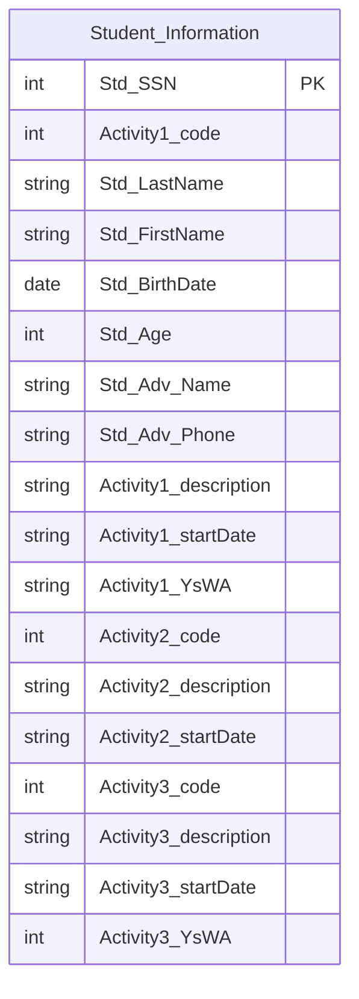
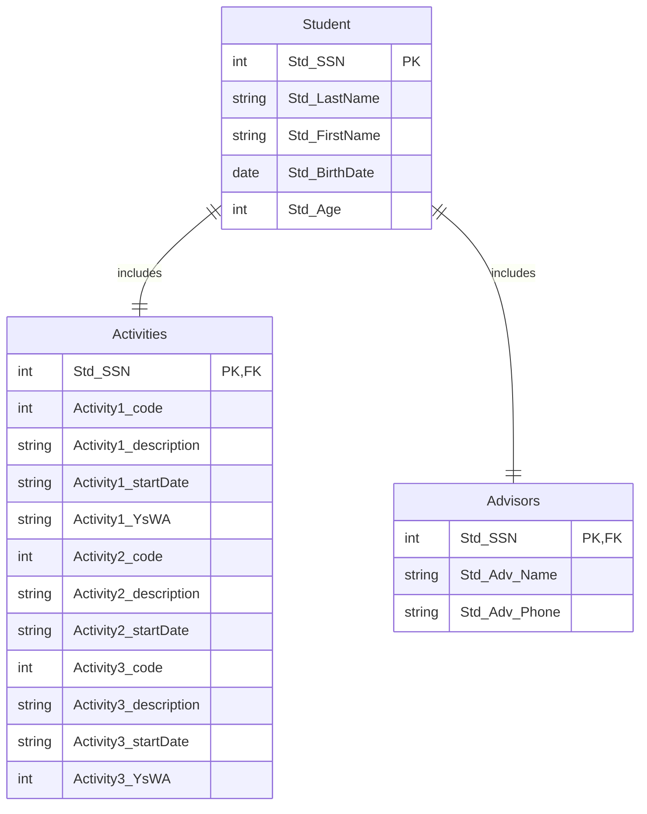

# Written By Noah Barrall
# Student activity File
## 1st Normal Form

## 2nd Normal Form

## 3rd Normal Form
```mermaid
erDiagram
    Student_Personal || --|| Advisor_Information : Includes
    Student_Personal || --|| Student_Participation : Includes
    Student_Participation || --|| Activity_1 : Includes
    Student_Participation || --|| Activity_2 : Includes
    Student_Participation || --|| Activity_3 : Includes
    Student_Personal {
        int Std_SSN PK
        string Std_last_name 
        string Std_first_name
        date Std_birth_date
    }
    Advisor_Information {
        int Std_SSN PK, FK
        string Std_Advisor_Name 
        string Std_Advisor_Phone
    }
    Student_Participation {
        int Std_SSN PK, FK
        int Years_with_Activity1 
        int Years_with_Activity2
        int Years_with_Activity3
    }
    Activity_1 {
        int Activity_1 PK, FK
        string Activity_1_description
        date Activity_1_start_date
    }
    Activity_2 {
        int Activity_2 PK, FK
        string Activity_2_description
        date Activity_2_start_date
    }
    Activity_3 {
        int Activity_3 PK, FK
        string Activity_3_description
        date Activity_3_start_date
    }
