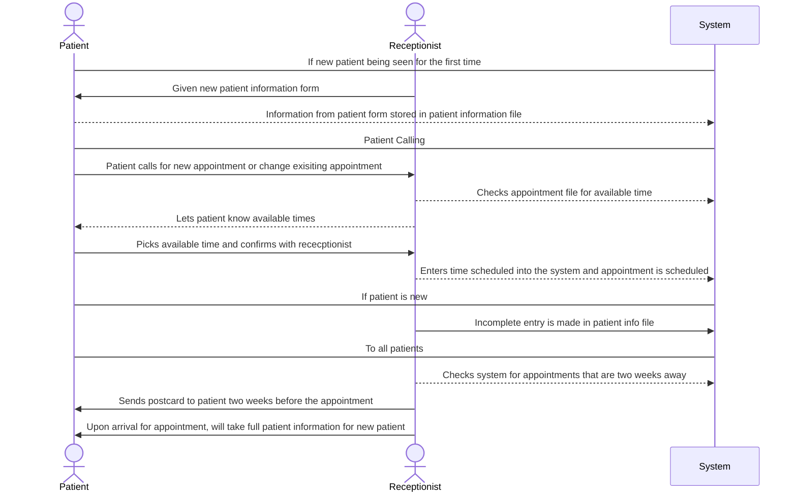
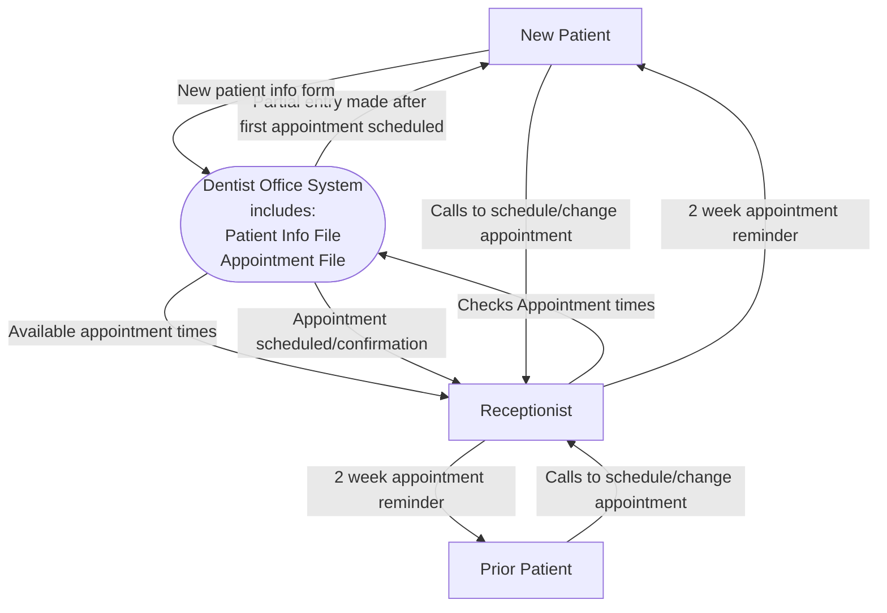

# Created by Noah Barrall
## Use Cases and Process Models

# Use Cases: Question 1
> A set of use cases that illustrate the basic processes that the system needs to support.

### Use Case Name : New Patient Arrival: Question 3 (for all)

> __ID__ : DO1

> __Priority__ : Medium

> __Actor__ : New Patient

> __Description__ : This use case describes how a new patient enters their personal information 

> __Trigger__ : New patient arives and is prompted by receptionist

> __Type__ : External

> __Preconditions__ :
>   1. Patient is coming into office for first time
>   2. Receptionist is at desk
>   3. Office system is up, and patient information file is accessible

| Normal Course: | Information for Steps |
|---|---|
|1.0 New Patient Arrival||
|1. Patient arrives at office for first time. | --> Receptionist to be at desk  |
|2. Receptionist gives patient new information form to fill out|<--- New patient information form|
|3. Form is filled out by new patient. |
|4. Receptionist recieves form, and enters information in system. | --> Information put into file in system |

> __Postconditions__ :
>   1. Patient information gathered
>   2. System file completed

|Summary Inputs|Source|Summary Outputs| Destination|
|---|---|---|---|
|Patient information form|Receptionist|Patient Information File|Dentist Office System|

 

### Use Case Name : Patient Incoming Call

> __ID__ : DO2

> __Priority__ : High

> __Actor__ : Receptionist

> __Description__ : New/Prior patient calling to schedule or change an existing appointment

> __Trigger__ : Patient makes a call to dental office

> __Type__ : External

> __Preconditions__ :
>   1. Patient calls office
>   2. Available appointment time
>   3. Appointment file is accessible

| Normal Course: | Information for steps |
|---|---|
|1.0 Patient Incoming Call||
|1. Incoming call from patient| <--- Receptionist needs to answer phone  |
|2. Patient schedules or changes appointment |<--- Appointment file accessible|
|3. Receptionist will let patient know available times |
|4. Patient will pick time | 
|5. Receptionist enters time into appointment file | <--- New appointment record in file|

> __Postconditions__ :
>   1. Patient appointment record created and stored

|Summary Inputs|Source|Summary Outputs| Destination|
|---|---|---|---|
|Available appointment times|Receptionist|Appointment confirmed|Appointment File|

### Use Case Name : New Patient End of Call

> __ID__ : DO3

> __Priority__ : Low

> __Actor__ : Receptionist

> __Description__ : New patient will get an incomplete entry into the patient information file upon end of initial call

> __Trigger__ : New patient confirms appointment

> __Type__ : External

> __Preconditions__ :
>   1. New patient nearing end of call
>   2. Receptionist preps entry into file 

| Normal Course: | Information for steps |
|---|---|
|1.0 New Patient End of Call||
|1. New patient nearing end of call| <--- Must be new patient|
|2. Receptionist uses phone number to create incomplete entry| <--- Patient info file|
|3. Receptionist confirms appointment| <--- New appointment record|

> __Postconditions__ :
>   1. Incomplete entry made for new patient

|Summary Inputs|Source|Summary Outputs| Destination|
|---|---|---|---|
|Phone number from caller|Receptionist|Incomplete entry|Patient info trouble|

### Use Case Name : 2 Week Reminder

> __ID__ : DO4

> __Priority__ : Low

> __Actor__ : Receptionist

> __Description__ : Receptionist will send out reminder postcard to patient when appointment is 2 weeks away

> __Trigger__ : System reminder for upcoming appointments

> __Type__ : Temporal

> __Preconditions__ :
>   1. Postcards available
>   2. System up and running
>   3. Appointment file accessible

| Normal Course: | Information for steps |
|---|---|
|1.0 2 Week Reminder||
|1. Receptionist checks for postcards | <--- Postcards |
|2. Receptionist checks for system updates of patients that have appointments in 2 weeks |<--- Appointment file|
|3. Receptionist preps postcards | 

> __Postconditions__ :
>   1. 2 Week reminder postcard sent

|Summary Inputs|Source|Summary Outputs| Destination|
|---|---|---|---|
|Postcard information|Patient info file|Postcard created|Patient|

# Process Model: Question 2
> Data Flow Diagram of Dentist Office System

    